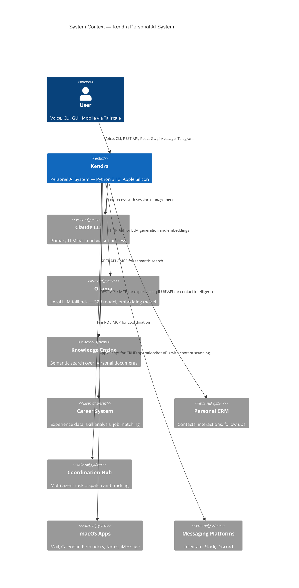
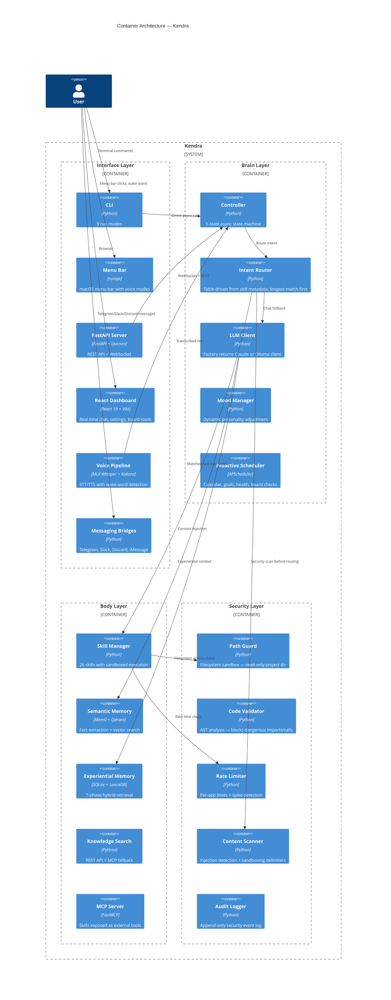
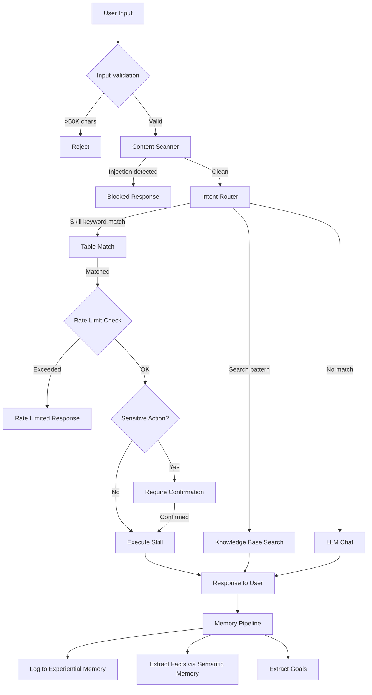
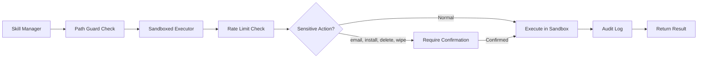
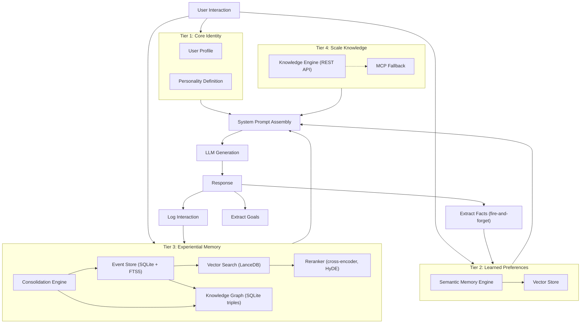
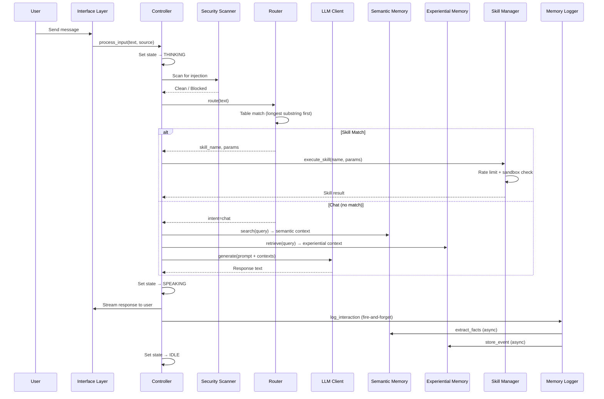

# Kendra — System Architecture

> C4 Model architecture documentation for the Kendra personal AI system.

---

## System Context (C4 Level 1)

---

## Container Architecture (C4 Level 2)

---

## Key Design Decisions

| Decision | Choice | Why | Alternatives Considered |
|----------|--------|-----|------------------------|
| Primary LLM | Claude CLI (subprocess) | Session management, MCP tool integration, cost tracking built-in | Direct API (no tool integration), local-only (limited reasoning) |
| LLM Fallback | Ollama (32B, M4 Max optimized) | Full local privacy, zero API cost, ~40 tok/s on Apple Silicon | No fallback (fragile), cloud API (privacy concern) |
| Intent Routing | Table-driven from skill metadata | Auto-discovery, no code changes to add skills, longest-match specificity | LLM-based classification (non-deterministic), hardcoded if-elif (inflexible) |
| Semantic Memory | Mem0 + Qdrant (embedded, no server) | Production-grade fact extraction, semantic dedup, contradiction resolution | Hand-rolled extraction (brittle), other vector DBs (less mature dedup) |
| Experiential Memory | SQLite + FTS5 + LanceDB | Hybrid BM25+vector with RRF fusion, bitemporal knowledge graph, consolidation | Single-vector-only (loses lexical precision), PostgreSQL (overkill for local) |
| Security Sandbox | Executor wrapping builtins at runtime | Thread-safe, audit trail, no container overhead, allowlisted safe dirs | Docker containers (heavy for single-user), chroot (complex), trust model (unsafe) |
| Voice STT | MLX Whisper (large-v3) | Apple Silicon native Metal acceleration, local-first, no cloud | Whisper.cpp (less Python integration), cloud STT (privacy concern) |
| GUI | React 19 + Vite + Zustand + WebSocket | Real-time streaming, modern tooling, runs alongside menu bar | PyQt (desktop-only, thread conflicts with menu bar), vanilla HTML (limited reactivity) |
| Skill System | Subdirectory pattern (metadata + implementation) | Auto-discovery via directory scan, self-documenting triggers, isolated and testable | Plugin registry (complex wiring), monolithic router (fragile, hard to extend) |
| State Machine | 5-state enum (IDLE/LISTENING/THINKING/SPEAKING/ERROR) | Deterministic, debuggable, prevents concurrent processing conflicts | Free-form (unpredictable), FSM library (unnecessary dependency) |

---

## Data Flow

### Primary Request Flow

### Skill Execution Flow

---

## Memory Architecture

### Retrieval Pipeline (Experiential Memory)

1. **Query** arrives from controller
2. **Lexical search** — BM25 via FTS5 with porter stemming, scope/time/type filters
3. **Vector search** — LanceDB with 1024-dim embeddings, multi-resolution
4. **Fusion** — Reciprocal Rank Fusion (k=60, vector weight=0.7, FTS weight=0.3)
5. **Reranking** — Cross-encoder reranking of fused results
6. **Advanced** — HyDE (hypothetical document expansion), multi-query decomposition
7. **Context Assembly** — Token-budget-aware formatting for LLM prompt

### Consolidation Engine ("Sleep Cycle")

- Watermark-based processing (only new events since last run)
- Conversation grouping and summarization
- Knowledge graph entity extraction (triples with bitemporal tracking)
- Temporal decay (older facts lose weight, contradictions resolved by recency)

---

## Security Posture

| Concern | Approach |
|---------|----------|
| Authentication | Bearer token for API (skip for local access), passphrase for messaging, rate limiting |
| Path Protection | Sandbox executor: project dir read-only, designated staging area writable, symlink resolution |
| Code Safety | AST validator blocks 41+ dangerous imports, 10+ dangerous calls, Bandit static analysis |
| Rate Limiting | Per-app limits (Mail 3/min, Calendar 10/min, etc.), spike detection >10/min |
| Content Safety | Prompt injection detection, content sandboxing with delimiters, PII redaction |
| Input Validation | 50K character limit, content scanning on every input, file validation |
| Source Authentication | Source parameter threaded through controller → router → skill manager; meta-skills blocked from non-local |
| Audit Trail | Append-only security event log (sensitive actions, rate limit events, auth attempts) |
| Data at Rest | SQLite files excluded from version control, full disk encryption, no secrets in committed code |
| Pre-commit | 12-phase security scanner (secrets, YAML values, .env, PII, code patterns, compliance) |

---

## Technology Stack

| Layer | Technology | Role |
|-------|-----------|------|
| Language | Python 3.13 | Core implementation, async/await throughout |
| Primary LLM | Claude CLI | Session management, MCP tools, cost tracking |
| Local LLM | Ollama (32B model) | Privacy-first fallback, Apple Silicon optimized (~40 tok/s) |
| Embeddings | Ollama (1024-dim model) | Semantic similarity for memory and retrieval |
| STT | MLX Whisper (large-v3) | Apple Silicon native speech-to-text via Metal |
| TTS | Kokoro ONNX | Local text-to-speech |
| Wake Word | Porcupine / OpenWakeWord | Sub-50ms activation |
| Frontend | React 19, TypeScript, Vite, Zustand, Tailwind CSS | Real-time dashboard with WebSocket streaming |
| API | FastAPI + Uvicorn | REST API + WebSocket server |
| Semantic Memory | Mem0 + Qdrant (embedded) | LLM-driven extraction, dedup, contradiction resolution |
| Experiential Memory | SQLite (WAL) + FTS5 + LanceDB | Event store, BM25, vector search, knowledge graph |
| macOS Integration | AppleScript, rumps, pynput | Menu bar, hotkey, Apple app integration |
| MCP | FastMCP | Bidirectional tool integration |
| Browser | Playwright | Headless Chromium automation |
| Messaging | python-telegram-bot, slack-sdk, discord.py | Multi-channel bridges |
| Testing | pytest (backend), vitest + RTL (frontend) | 3,863+ tests across 107 files |
| Security | Bandit, custom AST validator, 12-phase scanner | Static analysis + runtime sandboxing |

---

## Component Interaction

### Chat Request Lifecycle

---

*Architecture documentation for the Kendra personal AI system.*
