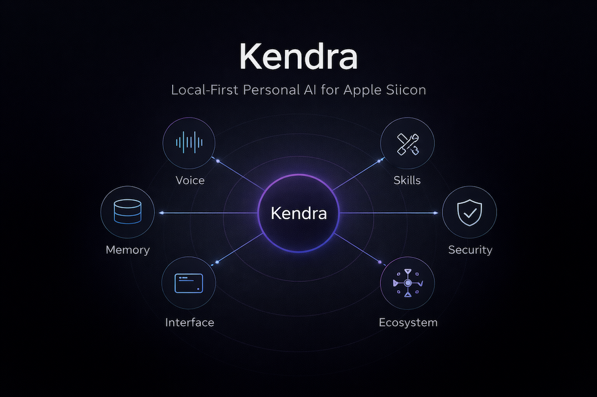

# Kendra

**A local-first personal AI system that orchestrates voice interaction, semantic memory, and 26 automation skills through a privacy-first architecture on Apple Silicon — using Claude CLI as the primary LLM with a local Ollama fallback for zero-cloud operation.**

Kendra is a three-layer personal AI controller built in Python 3.13, designed for an M4 Max MacBook Pro. It combines deterministic intent routing with LLM-powered conversation, four-tier memory (core identity, semantic facts, experiential recall, and knowledge base search), and deep macOS integration through AppleScript. The system runs entirely on-device or through authenticated CLI — no cloud APIs required for core operation.

> **This is a showcase repository.** It demonstrates the system architecture, design decisions, and capabilities of a private project. Source code is not included. For technical inquiries, open an [issue](../../issues/new?template=inquiry.yml).

---

## Architecture Highlights

### 1. Three-Layer Architecture with Deterministic Routing

The system separates concerns into three distinct layers: an **Interface Layer** (CLI, macOS menu bar, voice pipeline, FastAPI server, React dashboard, and messaging bridges), a **Brain Layer** (async state machine controller, table-driven intent router, LLM client factory, mood manager, and proactive scheduler), and a **Body Layer** (skill manager, memory systems, RAG search, MCP server, and security sandbox). Intent routing is fully deterministic — a table-driven router built from each skill's metadata matches user input by longest substring first, ensuring predictable behavior without LLM classification overhead.

### 2. Four-Tier Memory Architecture

Memory spans four tiers of increasing scope. **Tier 1** (Core Identity) loads user profile and personality into every system prompt. **Tier 2** (Learned Preferences) uses Mem0 with Qdrant vector search for LLM-driven fact extraction, semantic deduplication, and contradiction resolution through ADD/UPDATE/DELETE operations. **Tier 3** (Experiential Memory) is a custom "Total Recall" engine — an append-only event store with hybrid BM25+vector retrieval using Reciprocal Rank Fusion, a bitemporal knowledge graph, and a consolidation engine that performs summarization, entity extraction, and temporal decay. **Tier 4** (Scale Knowledge) connects to an external RAG engine for semantic search over personal documents.

### 3. Defense-in-Depth Security

Security operates at multiple layers without container overhead. A **Path Guard** makes the project directory read-only during skill execution, resolving symlinks to prevent traversal. A **Code Validator** performs AST-based static analysis, blocking dangerous imports and calls before any generated code is staged. A **Rate Limiter** enforces per-application limits with spike detection to prevent runaway LLM loops. Additional layers include content sandboxing (external data wrapped in delimiters so the LLM treats it as data, not commands), prompt injection detection on every input, and an append-only audit log for all sensitive actions.

### 4. Ecosystem Integration

Kendra serves as the orchestration hub for a multi-project ecosystem. It connects to a career management system for experience data and job analysis, a personal CRM for contact intelligence and follow-up tracking, a knowledge engine for semantic document search, and a multi-agent coordination hub for cross-project task dispatch. Native macOS integration covers Mail, Calendar, Reminders, Notes, and iMessage through AppleScript, while messaging bridges connect Telegram, Slack, and Discord. A bidirectional MCP server exposes Kendra's skills as tools for external LLM agents.

---

## Feature Overview

| Feature | Technical Approach | Business Value |
|---------|-------------------|----------------|
| **Voice Interaction** | MLX Whisper (Apple Silicon native) + Kokoro TTS with wake word detection | Hands-free operation with sub-50ms activation |
| **Dual LLM Backend** | Claude CLI (primary) with Ollama local fallback | Privacy-first with zero-cloud operation when needed |
| **Table-Driven Routing** | Skills register triggers via metadata; router matches by longest substring | Deterministic behavior, no LLM classification latency, auto-discovery |
| **26 Automation Skills** | Subdirectory pattern with sandboxed execution and rate limiting | Modular, testable, independently deployable capabilities |
| **Semantic Memory** | Mem0 + Qdrant for fact extraction with dedup and contradiction resolution | Learns preferences across conversations without explicit commands |
| **Experiential Memory** | Custom hybrid retrieval: BM25 + vector search + RRF fusion + reranking | "What did I say about X last week?" with high recall accuracy |
| **Knowledge Graph** | SQLite triple store with bitemporal tracking and graph traversal | Relationship discovery and temporal reasoning across experiences |
| **Consolidation Engine** | Watermark-based "sleep cycle" with summarization and entity extraction | Memory grows richer over time without unbounded storage growth |
| **Real-Time Dashboard** | React 19 + Vite + Zustand with WebSocket streaming | Live chat, settings management, board room, activity monitoring |
| **macOS Integration** | AppleScript CRUD for Mail, Calendar, Reminders, Notes, iMessage | Native app control without third-party dependencies |
| **Multi-Channel Messaging** | Telegram, Slack, Discord bridges with content scanning | Interact from any platform with consistent security |
| **Proactive Scheduling** | APScheduler with calendar, goals, health, and board check-ins | Kendra initiates relevant interactions without being asked |
| **Advisory Board** | 6-persona board meeting engine with streaming and action items | Multi-perspective strategic counsel on demand |
| **Cross-Project Delegation** | Multi-agent dispatch with transport adapters (CLI, REST, file I/O) | Orchestrate work across the entire project ecosystem |

---

## By the Numbers

| Metric | Value |
|--------|-------|
| Passing Tests | 3,863 across 107 test files (86 backend + 21 frontend) |
| Automation Skills | 26 (25 user-facing + meta skill builder) |
| Memory Tiers | 4 (identity, semantic, experiential, knowledge base) |
| Run Modes | 9 (chat, voice, listen, app, server, search, status, setup, token) |
| Security Layers | 6 (path guard, code validator, rate limiter, content sandbox, injection detection, audit log) |
| Messaging Channels | 5 (CLI, voice, Telegram, Slack, Discord) |
| Interface Options | 6 (CLI, menu bar, voice, REST API, React GUI, messaging bridges) |
| Ecosystem Integrations | 10+ (Claude CLI, Ollama, knowledge engine, career system, CRM, coordination hub, Apple apps, MCP, Playwright, Tailscale) |
| Local LLM Performance | ~40 tokens/sec (Qwen 2.5 32B on M4 Max) |
| Voice Activation | Sub-50ms wake word detection |

---

## Technology Stack

| Layer | Technology | Role |
|-------|-----------|------|
| **Language** | Python 3.13 | Core implementation, async/await throughout |
| **Primary LLM** | Claude CLI (Opus) | Session management, MCP tools, cost tracking |
| **Local LLM** | Ollama (Qwen 2.5 32B) | Privacy-first fallback, M4 Max optimized |
| **Embeddings** | Ollama (mxbai-embed-large, 1024-dim) | Semantic similarity for memory and retrieval |
| **STT** | MLX Whisper (large-v3) | Apple Silicon native speech-to-text via Metal |
| **TTS** | Kokoro ONNX | Local text-to-speech |
| **Wake Word** | Porcupine / OpenWakeWord | Sub-50ms activation |
| **Frontend** | React 19, TypeScript, Vite, Zustand, Tailwind CSS | Real-time dashboard with WebSocket streaming |
| **API** | FastAPI + Uvicorn | REST API + WebSocket server |
| **Semantic Memory** | Mem0 + Qdrant (embedded) | LLM-driven extraction, dedup, contradiction resolution |
| **Experiential Memory** | SQLite (WAL) + FTS5 + LanceDB | Event store, BM25, vector search, knowledge graph |
| **macOS Integration** | AppleScript, rumps, pynput | Menu bar, hotkey, Apple app integration |
| **MCP** | FastMCP | Bidirectional tool integration |
| **Browser** | Playwright | Headless Chromium automation |
| **Messaging** | python-telegram-bot, slack-sdk, discord.py | Multi-channel bridges |
| **Testing** | pytest (backend), vitest + RTL (frontend) | Comprehensive test coverage |
| **Security** | Bandit, custom AST validator, 12-phase scanner | Static analysis + runtime sandboxing |

---

## System Design

For the complete architecture including C4 diagrams, data flow, memory pipeline, and design decision rationale:

**[View Full Architecture Documentation](ARCHITECTURE.md)**

---

## About

Kendra was designed to solve a fundamental limitation of current AI assistants: they lack persistent memory, local-first privacy, and deep integration with the user's actual computing environment. Rather than rely on cloud-hosted chat interfaces, Kendra runs entirely on-device, orchestrating multiple LLM backends, maintaining rich memory across conversations, and automating real tasks through native macOS integration.

The three-layer architecture ensures that business logic remains deterministic (table-driven routing, state machine control) while leveraging LLM capabilities where they excel (natural language understanding, fact extraction, content generation). The four-tier memory system means Kendra genuinely learns and improves over time — remembering preferences, building a knowledge graph from past interactions, and proactively surfacing relevant context.

---

Copyright 2026 TJ Neary. All Rights Reserved.
